# 🛡️ AEGIS AI - Advanced Fraud Detection System

<div align="center">


**An AI-powered fraud detection system leveraging Google's Gemini AI for real-time transaction analysis**

[Features](#-features) • [Architecture](#-architecture) • [Installation](#-installation) • [API Documentation](#-api-documentation) • [Usage](#-usage)

</div>

---

## 📋 Table of Contents

- [Overview](#-overview)
- [Features](#-features)
- [System Architecture](#-system-architecture)
- [Technology Stack](#-technology-stack)
- [Installation](#-installation)
- [Configuration](#-configuration)
- [API Documentation](#-api-documentation)
- [Usage Examples](#-usage-examples)
- [Security Features](#-security-features)
- [Monitoring & Analytics](#-monitoring--analytics)
- [Contributing](#-contributing)
- [License](#-license)

---

## 🎯 Overview

AEGIS AI is a sophisticated fraud detection system that combines artificial intelligence with traditional rule-based analysis to provide real-time transaction monitoring and risk assessment. The system uses Google's Gemini AI to analyze transaction patterns, user behavior, and contextual data to identify potentially fraudulent activities.

### Key Capabilities

- **Real-time Analysis**: Instant fraud detection with sub-second response times
- **AI-Powered Intelligence**: Leverages Google Gemini AI for advanced pattern recognition
- **Adaptive Learning**: Continuously learns from transaction patterns and fraud indicators
- **Multi-factor Risk Assessment**: Analyzes 7+ risk factors for comprehensive evaluation
- **User Behavior Profiling**: Builds and maintains dynamic user risk profiles
- **Interactive Dashboard**: Real-time monitoring with cyberpunk-themed UI

---

## ✨ Features

### 🔍 Core Detection Features
- **AI-Powered Analysis**: Google Gemini AI integration for intelligent fraud detection
- **Multi-dimensional Risk Scoring**: 7-factor risk assessment model
- **Real-time Processing**: Sub-second transaction analysis
- **Adaptive User Profiling**: Dynamic risk profile management
- **Pattern Recognition**: Fraud pattern detection and learning
- **Fallback Analysis**: Rule-based backup system for AI failures

### 🛡️ Security Features
- **Rate Limiting**: Configurable request throttling
- **Input Validation**: Comprehensive transaction data validation
- **Helmet Security**: HTTP security headers
- **CORS Protection**: Cross-origin request security
- **Environment-based Configuration**: Secure configuration management

### 📊 Analytics & Monitoring
- **Real-time Dashboard**: Interactive fraud monitoring interface
- **Transaction History**: Comprehensive transaction logging
- **Risk Statistics**: Detailed fraud analytics
- **User Profiles**: Individual risk assessment tracking
- **Performance Metrics**: System health and performance monitoring

---

## 🏗️ System Architecture

```mermaid
graph TB
    subgraph "Client Layer"
        UI[Web Dashboard<br/>index1.html]
        API_CLIENT[API Clients]
    end
    
    subgraph "API Gateway"
        MIDDLEWARE[Security Middleware<br/>• Rate Limiting<br/>• CORS<br/>• Helmet<br/>• Validation]
    end
    
    subgraph "Core Application"
        SERVER[Express Server<br/>server.js]
        ROUTES[API Routes<br/>• /api/analyze-fraud<br/>• /api/health<br/>• /api/stats<br/>• /api/user/*]
    end
    
    subgraph "AI Processing Engine"
        GEMINI[Google Gemini AI<br/>gemini-1.5-flash]
        FALLBACK[Rule-based Fallback<br/>Backup Analysis]
        ANALYSIS[Fraud Analysis Engine<br/>• Risk Scoring<br/>• Pattern Detection<br/>• User Profiling]
    end
    
    subgraph "Data Layer"
        MEMORY[(In-Memory Storage<br/>• Transaction History<br/>• User Profiles<br/>• Fraud Patterns)]
        CACHE[Risk Profile Cache]
    end
    
    subgraph "External Services"
        GEMINI_API[Google Generative AI API]
    end
    
    UI --> MIDDLEWARE
    API_CLIENT --> MIDDLEWARE
    MIDDLEWARE --> SERVER
    SERVER --> ROUTES
    ROUTES --> ANALYSIS
    ANALYSIS --> GEMINI
    ANALYSIS --> FALLBACK
    GEMINI --> GEMINI_API
    ANALYSIS --> MEMORY
    ANALYSIS --> CACHE
    
    classDef client fill:#0A192F,stroke:#00FFFF,color:#fff
    classDef security fill:#4A148C,stroke:#FF00FF,color:#fff
    classDef core fill:#000000,stroke:#39FF14,color:#fff
    classDef ai fill:#1a1a2e,stroke:#00FFFF,color:#fff
    classDef data fill:#16213e,stroke:#FF00FF,color:#fff
    classDef external fill:#0f3460,stroke:#39FF14,color:#fff
    
    class UI,API_CLIENT client
    class MIDDLEWARE security
    class SERVER,ROUTES core
    class GEMINI,FALLBACK,ANALYSIS ai
    class MEMORY,CACHE data
    class GEMINI_API external
```



### Data Flow Diagram


---

## 🛠️ Technology Stack

### Backend Technologies
- **Runtime**: Node.js
- **Framework**: Express.js
- **AI Integration**: Google Generative AI (@google/generative-ai)
- **Security**: Helmet, CORS, Express Rate Limit
- **Validation**: Joi
- **Logging**: Winston, Morgan
- **Environment**: dotenv

### Frontend Technologies
- **HTML5**: Semantic markup
- **CSS3**: Advanced animations and glassmorphism effects
- **JavaScript**: ES6+ with async/await
- **Design**: Cyberpunk-themed responsive UI
- **Fonts**: Google Fonts (Poppins)

### Development Tools
- **Testing**: Jest, Supertest
- **Linting**: ESLint
- **Development**: Nodemon
- **Package Management**: npm

---

## 🚀 Installation

### Prerequisites
- Node.js (v14 or higher)
- npm (v6 or higher)
- Google Gemini API key

### Step-by-Step Installation

1. **Clone the Repository**
   ```bash
   git clone <repository-url>
   cd fraud-detection
   ```

2. **Install Dependencies**
   ```bash
   npm install
   ```

3. **Environment Configuration**
   ```bash
   cp .env.example .env
   ```
   
   Edit `.env` file with your configuration:
   ```env
   GEMINI_API_KEY=your_gemini_api_key_here
   NODE_ENV=development
   PORT=3000
   FRONTEND_URL=http://localhost:3000
   JWT_SECRET=your_jwt_secret_here
   RATE_LIMIT_WINDOW_MS=900000
   RATE_LIMIT_MAX_REQUESTS=100
   LOG_LEVEL=info
   ```

4. **Start the Application**
   ```bash
   # Development mode
   npm run dev
   
   # Production mode
   npm start
   ```

5. **Access the Dashboard**
   Open your browser and navigate to `http://localhost:3000`

---

## ⚙️ Configuration

### Environment Variables

| Variable | Description | Default | Required |
|----------|-------------|---------|----------|
| `GEMINI_API_KEY` | Google Gemini AI API key | - | ✅ |
| `NODE_ENV` | Environment mode | development | ❌ |
| `PORT` | Server port | 3000 | ❌ |
| `FRONTEND_URL` | Frontend URL for CORS | http://localhost:3000 | ❌ |
| `JWT_SECRET` | JWT signing secret | - | ✅ |
| `RATE_LIMIT_WINDOW_MS` | Rate limit window | 900000 | ❌ |
| `RATE_LIMIT_MAX_REQUESTS` | Max requests per window | 100 | ❌ |
| `LOG_LEVEL` | Logging level | info | ❌ |

### Rate Limiting Configuration

```javascript
// General API rate limiting
const limiter = rateLimit({
    windowMs: 15 * 60 * 1000, // 15 minutes
    max: 100, // 100 requests per window
});

// Fraud analysis specific rate limiting
const fraudAnalysisLimiter = rateLimit({
    windowMs: 1 * 60 * 1000, // 1 minute
    max: 10, // 10 fraud analyses per minute
});
```

---

## 📚 API Documentation

### Base URL
```
http://localhost:3000/api
```

### Authentication
Currently, the API doesn't require authentication, but it includes rate limiting for security.

### Endpoints

#### 🏥 Health Check
```http
GET /api/health
```

**Response:**
```json
{
  "status": "healthy",
  "timestamp": "2024-01-15T10:30:00.000Z",
  "version": "1.0.0",
  "uptime": 3600
}
```

#### 🔍 Fraud Analysis
```http
POST /api/analyze-fraud
```

**Request Body:**
```json
{
  "amount": 1500.00,
  "currency": "USD",
  "merchant": "Amazon",
  "cardType": "credit",
  "location": "New York, NY",
  "userId": "user123"
}
```

**Response:**
```json
{
  "success": true,
  "analysis": {
    "riskScore": 25,
    "summary": "Low-risk transaction approved based on normal spending patterns",
    "status": "Approved",
    "confidence": 95,
    "riskFactors": {
      "LocationAnomaly": 10,
      "AmountDeviation": 20,
      "MerchantRisk": 15,
      "TimePattern": 5,
      "CardUsage": 10,
      "UserBehavior": 15,
      "VelocityCheck": 5
    },
    "recommendations": [
      "Transaction approved",
      "Continue monitoring user activity"
    ],
    "alertLevel": "LOW",
    "timestamp": "2024-01-15T10:30:00.000Z",
    "transactionId": "TXN-1705315800000-ABC123"
  },
  "metadata": {
    "processedAt": "2024-01-15T10:30:00.000Z",
    "processingTime": 245
  }
}
```

#### 👤 User Transaction History
```http
GET /api/user/:userId/history?limit=50&offset=0
```

**Response:**
```json
{
  "success": true,
  "transactions": [
    {
      "amount": 1500.00,
      "currency": "USD",
      "merchant": "Amazon",
      "location": "New York, NY",
      "timestamp": "2024-01-15T10:30:00.000Z",
      "analysis": {
        "riskScore": 25,
        "status": "Approved"
      }
    }
  ],
  "total": 1
}
```

#### 📊 User Risk Profile
```http
GET /api/user/:userId/profile
```

**Response:**
```json
{
  "success": true,
  "profile": {
    "userId": "user123",
    "riskLevel": "LOW",
    "totalTransactions": 45,
    "suspiciousTransactions": 2,
    "recentSuspiciousActivity": false,
    "createdAt": "2024-01-01T00:00:00.000Z",
    "lastUpdated": "2024-01-15T10:30:00.000Z"
  }
}
```

#### 📈 System Statistics
```http
GET /api/stats
```

**Response:**
```json
{
  "success": true,
  "stats": {
    "totalTransactions": 1250,
    "approvedTransactions": 1100,
    "flaggedTransactions": 120,
    "deniedTransactions": 30,
    "averageRiskScore": 28.5,
    "uniqueUsers": 450,
    "fraudPatternsDetected": 15,
    "highRiskUsers": 8
  },
  "generatedAt": "2024-01-15T10:30:00.000Z"
}
```

#### 🕒 Recent Transactions
```http
GET /api/recent-transactions?limit=20
```

**Response:**
```json
{
  "success": true,
  "transactions": [
    {
      "id": "TXN-1705315800000-ABC123",
      "amount": 1500.00,
      "currency": "USD",
      "merchant": "Amazon",
      "location": "New York, NY",
      "status": "Approved",
      "riskScore": 25,
      "timestamp": "2024-01-15T10:30:00.000Z"
    }
  ]
}
```

---

## 💡 Usage Examples

### Basic Fraud Analysis

```javascript
// Example: Analyze a transaction
const analyzeTransaction = async () => {
  const transactionData = {
    amount: 2500.00,
    currency: "USD",
    merchant: "Best Buy",
    cardType: "credit",
    location: "Los Angeles, CA",
    userId: "user456"
  };

  try {
    const response = await fetch('/api/analyze-fraud', {
      method: 'POST',
      headers: {
        'Content-Type': 'application/json',
      },
      body: JSON.stringify(transactionData)
    });

    const result = await response.json();
    
    if (result.success) {
      console.log('Risk Score:', result.analysis.riskScore);
      console.log('Status:', result.analysis.status);
      console.log('Summary:', result.analysis.summary);
    }
  } catch (error) {
    console.error('Analysis failed:', error);
  }
};
```

### Dashboard Integration

```javascript
// Example: Real-time dashboard updates
const updateDashboard = async () => {
  // Fetch recent transactions
  const recentResponse = await fetch('/api/recent-transactions?limit=10');
  const recentData = await recentResponse.json();
  
  // Fetch system statistics
  const statsResponse = await fetch('/api/stats');
  const statsData = await statsResponse.json();
  
  // Update UI elements
  updateTransactionTable(recentData.transactions);
  updateStatistics(statsData.stats);
};

// Auto-refresh every 30 seconds
setInterval(updateDashboard, 30000);
```

---

## 🔒 Security Features

### Input Validation
```javascript
const validateTransaction = (req, res, next) => {
    const { amount, currency, merchant, cardType, location, userId } = req.body;
    
    const errors = [];
    
    if (!amount || amount <= 0) errors.push('Invalid amount');
    if (!currency || !['USD', 'EUR', 'GBP', 'JPY', 'CAD', 'AUD'].includes(currency)) 
        errors.push('Invalid currency');
    if (!merchant || merchant.length < 2) errors.push('Invalid merchant name');
    if (!cardType || !['credit', 'debit', 'prepaid'].includes(cardType)) 
        errors.push('Invalid card type');
    if (!location || location.length < 2) errors.push('Invalid location');
    if (!userId || userId.length < 3) errors.push('Invalid user ID');
    
    if (errors.length > 0) {
        return res.status(400).json({ error: 'Validation failed', details: errors });
    }
    
    next();
};
```

### Rate Limiting Strategy
- **General API**: 100 requests per 15 minutes per IP
- **Fraud Analysis**: 10 requests per minute per IP
- **Configurable**: Adjustable via environment variables

### Security Headers
- **Helmet.js**: Comprehensive HTTP security headers
- **CORS**: Configurable cross-origin resource sharing
- **Content Security**: Input sanitization and validation

---

## 📊 Monitoring & Analytics

### Risk Assessment Model

The system uses a 7-factor risk assessment model:


### Performance Metrics
- **Response Time**: Sub-second analysis (typically 100-500ms)
- **Throughput**: Up to 600 requests per hour per IP
- **Accuracy**: AI-enhanced pattern recognition
- **Availability**: 99.9% uptime target

### User Risk Profiling
```javascript
// Risk level calculation
const calculateRiskLevel = (profile) => {
  const suspiciousRatio = profile.suspiciousTransactions / profile.totalTransactions;
  
  if (suspiciousRatio > 0.3) return 'HIGH';
  if (suspiciousRatio > 0.1) return 'MEDIUM';
  return 'LOW';
};
```

---

## 🎨 Dashboard Features

### Cyberpunk-Themed Interface
- **Glassmorphism Design**: Modern glass-effect UI elements
- **Animated Components**: Real-time data visualization
- **Responsive Layout**: Mobile-friendly design
- **Dark Theme**: Eye-friendly cyberpunk aesthetic

### Real-time Components
- **Risk Gauge**: Animated risk score visualization
- **Transaction Ledger**: Live transaction monitoring
- **Threat Factors**: Dynamic risk factor display
- **World Map**: Geographic transaction visualization

### Interactive Elements
- **Form Validation**: Real-time input validation
- **Loading States**: Processing indicators
- **Error Handling**: User-friendly error messages
- **Responsive Feedback**: Visual confirmation of actions

---

## 🧪 Testing

### Running Tests
```bash
# Run all tests
npm test

# Run tests in watch mode
npm run test:watch

# Run linting
npm run lint

# Fix linting issues
npm run lint:fix
```

### Test Coverage
- **Unit Tests**: Core functionality testing
- **Integration Tests**: API endpoint testing
- **Security Tests**: Input validation and rate limiting
- **Performance Tests**: Response time and throughput

---

## 🚀 Deployment

### Production Checklist
- [ ] Set `NODE_ENV=production`
- [ ] Configure production database
- [ ] Set up proper logging
- [ ] Configure reverse proxy (nginx)
- [ ] Set up SSL certificates
- [ ] Configure monitoring
- [ ] Set up backup strategy

### Docker Deployment
```dockerfile
FROM node:18-alpine

WORKDIR /app

COPY package*.json ./
RUN npm ci --only=production

COPY . .

EXPOSE 3000

CMD ["npm", "start"]
```

### Environment-Specific Configuration
```bash
# Development
NODE_ENV=development
LOG_LEVEL=debug

# Production
NODE_ENV=production
LOG_LEVEL=info
```

---

## 🤝 Contributing

### Development Setup
1. Fork the repository
2. Create a feature branch
3. Make your changes
4. Add tests for new functionality
5. Ensure all tests pass
6. Submit a pull request

### Code Style
- Follow ESLint configuration
- Use meaningful variable names
- Add JSDoc comments for functions
- Maintain consistent formatting

### Commit Convention
```
feat: add new fraud detection algorithm
fix: resolve rate limiting issue
docs: update API documentation
test: add unit tests for user profiling
```

---

## 📄 License

This project is licensed under the MIT License - see the [LICENSE](LICENSE) file for details.

---

## 🆘 Support

### Getting Help
- **Documentation**: Check this README and inline code comments
- **Issues**: Report bugs and feature requests via GitHub Issues
- **Discussions**: Join community discussions for questions and ideas

### Common Issues

#### API Key Issues
```bash
# Error: API key missing
# Solution: Check .env file configuration
GEMINI_API_KEY=your_actual_api_key_here
```

#### Rate Limiting
```bash
# Error: Too many requests
# Solution: Implement request queuing or increase limits
RATE_LIMIT_MAX_REQUESTS=200
```

#### Memory Usage
```bash
# For high-volume deployments, consider:
# - Implementing Redis for data storage
# - Database integration for persistence
# - Horizontal scaling
```

---

## 🔮 Future Enhancements

### Planned Features
- [ ] **Database Integration**: PostgreSQL/MongoDB support
- [ ] **Machine Learning**: Custom ML model training
- [ ] **Real-time Alerts**: WebSocket notifications
- [ ] **Advanced Analytics**: Detailed reporting dashboard
- [ ] **Multi-tenant Support**: Organization-level isolation
- [ ] **API Authentication**: JWT-based security
- [ ] **Webhook Integration**: External system notifications
- [ ] **Mobile App**: React Native companion app

### Roadmap
- **Q1 2024**: Database integration and persistence
- **Q2 2024**: Advanced ML models and training pipeline
- **Q3 2024**: Real-time notifications and webhooks
- **Q4 2024**: Mobile application and multi-tenant support

---

<div align="center">

**Built with ❤️ by the AEGIS Team**


</div>